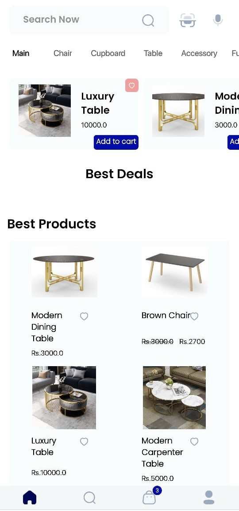
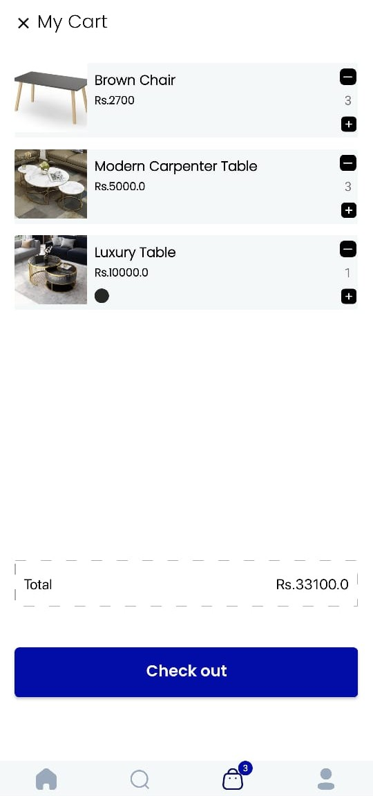
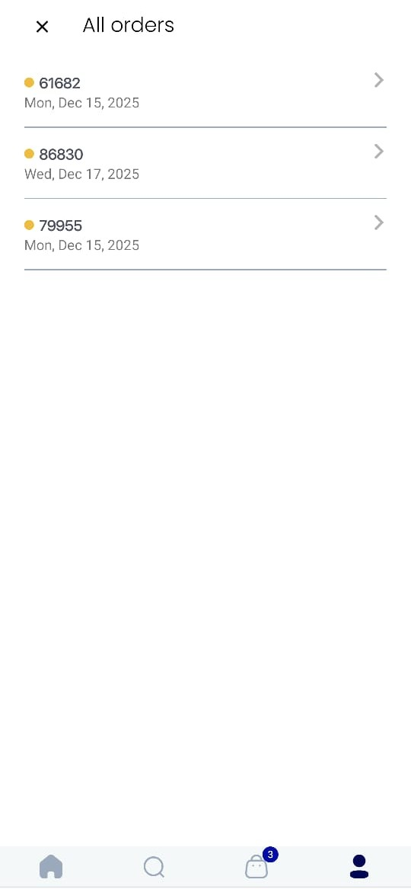
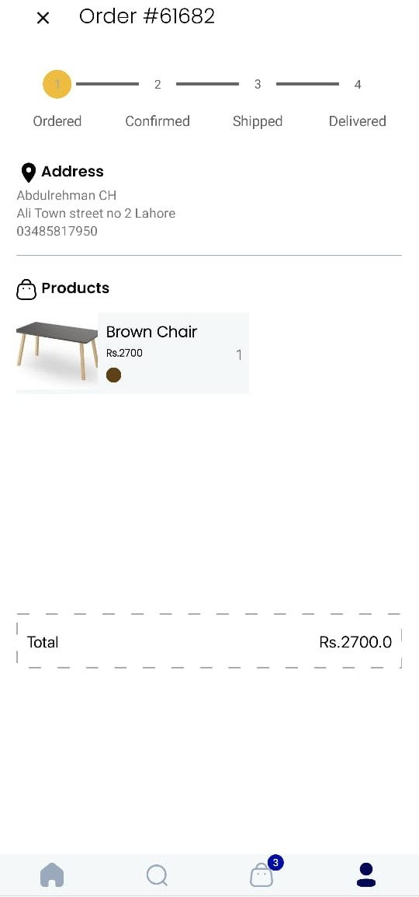
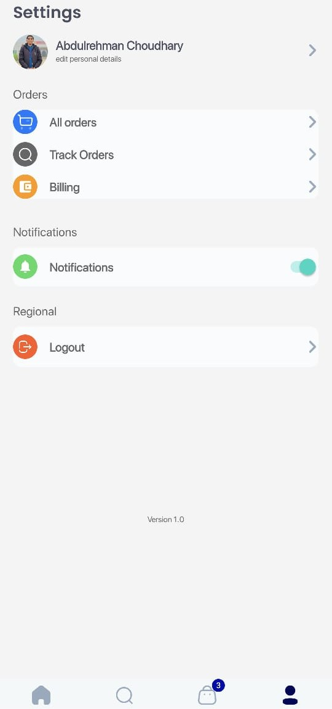

# Modern-ecommerce-app (Raza Shop)
> A sleek, high-performance Android e-commerce solution built with Kotlin, focused on reactive data streams and modern UI.


---

## 📱 App Screenshots
| Welcome & Auth | Product Discovery | Shopping Cart |
| :---: | :---: | :---: |
|  |  |  |
| **Order Details** | **Order Tracking** | **User Profile** |
|  |  |  |

---

## 📝 Description
**Raza Shop** is a modern e-commerce application designed to demonstrate the power of **Kotlin Coroutines and Flows** in a real-world scenario. The app features a streamlined MVVM architecture where the ViewModel communicates directly with a robust **Data Layer**.

The Data Layer serves as the single source of truth, housing all **Data Classes** (Models) and the **Supabase Client** logic for cloud media management.

## ✨ Key Features
* 👤 **Secure Authentication** – Login and Signup handled via Firebase Auth.
* 🛍️ **E-commerce Essentials** – Browse products, add items to cart, and proceed to checkout.
* 🚚 **Order Tracking** – Monitor the status of your orders in real-time via Firestore.
* 🖼️ **Dynamic Media** – Product images are hosted on Supabase and loaded efficiently using Glide.
* 📑 **Modern UI** – Utilizes ViewPager2 for a smooth, tabbed browsing experience.

## 🛠️ Tech Stack
* **Language:** Kotlin (Coroutines & Flows)
* **Architecture:** MVVM (Model-View-ViewModel)
* **DI:** Dagger Hilt
* **Database/Auth:** Firebase (Firestore & Auth)
* **Storage:** Supabase (Image saving)
* **Image Loading:** Glide
* **UI Components:** XML, ViewPager2

---

## ⚙️ Architecture Overview
This project follows a simplified MVVM pattern:
* **UI (Activities/Fragments):** Uses ViewBinding and observes StateFlows from the ViewModel.
* **ViewModel:** Manages UI state and executes business logic using Coroutines.
* **Data Layer:** Contains all Data Classes and the Supabase/Firebase client implementations for direct data access.


---

## 🚀 Installation & Setup

### Prerequisites
* **Android Studio** (Latest Stable Version)
* **Stable Internet Connection**
* Basic knowledge of Kotlin and Android Development

### Steps to Run
1. **Clone the repository:**
   ```bash
   git clone [https://github.com/Abdulrehman-dev95/Modern-Ecommerce-App.git](https://github.com/Abdulrehman-dev95/Modern-Ecommerce-App.git)

2. **Connect the app to Firebase:**
   
   Create new project in **Firebase Console** and connect to this app by adding a google.json.services file.

4. **Add Supabase:**

   Add the Supabase url, key and bucketName in local Properties Gradle File

**After all Click on sync project and ran the App.**

## 🤝 Contributing
Contributions are welcome! Please feel free to submit a Pull Request.
